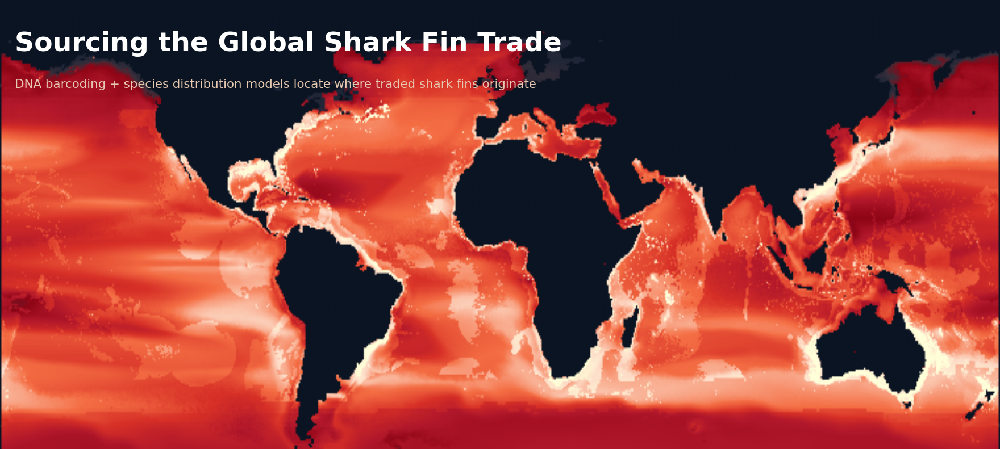

# sourcing_shark_fins

Data and code for **"Coastal sharks supply the global shark fin trade,"** published open access in *Biology Letters* (2020).

[](https://doi.org/10.1098/rsbl.2020.0609)
[](https://pmc.ncbi.nlm.nih.gov/articles/PMC7655481/)
[](https://creativecommons.org/licenses/by/4.0/)
[](https://www.r-project.org/)

> Van Houtan KS, Gagné TO, Reygondeau G, Tanaka KR, Palumbi SR, Jorgensen SJ (2020) Coastal sharks supply the global shark fin trade. *Biology Letters* 16(10):20200609. https://doi.org/10.1098/rsbl.2020.0609
>
> *Monterey Bay Aquarium; Duke University; University of British Columbia; Yale University; Stanford University (Hopkins Marine Station). Supplementary materials: [figshare 10.6084/m9.figshare.c.5178281](https://doi.org/10.6084/m9.figshare.c.5178281).*

---

## Abstract

Progress in global shark conservation has been limited by constraints to understanding the species composition and geographic origins of the shark fin trade. Previous assessments that relied on earlier genetic techniques and official trade records focused on abundant pelagic species traded between Europe and Asia. Here, we combine recent advances in DNA barcoding and species distribution modelling to identify the species and source the geographic origin of fins sold at market. Derived models of species environmental niches indicated that shark fishing effort is concentrated within Exclusive Economic Zones, mostly in coastal Australia, Indonesia, the United States, Brazil, Mexico and Japan. By coupling two distinct tools, barcoding and niche modelling, our results provide new insights for monitoring and enforcement. They suggest stronger local controls of coastal fishing may help regulate the unsustainable global trade in shark fins.

---

## What this project does

The shark fin trade is worth nearly US$400 million and kills on the order of 100 million sharks a year, but fins are heavily processed and mixed in market stockpiles, so the **species** and the **geographic origin** of traded fins are hard to determine. This project couples two complementary tools to narrow that problem:

1. **DNA barcoding** identifies *which* species are in the trade. The analysis draws on four published market-barcoding studies that, together, identified the source species of more than 5,000 individual fins from markets in **Hong Kong, Vancouver, San Francisco, and northern Brazil**.
2. **Species distribution models (SDMs)** identify *where* those species live. Each identified species' modeled environmental niche is weighted by how many fins of that species appeared in a seizure, then Monte-Carlo sampled and summed to map the most probable fishing locations.

Overlaying the resulting sourcing surface on global maritime boundaries shows that the probable fishing effort falls overwhelmingly **inside Exclusive Economic Zones (EEZs)** — concentrated in coastal Australia, Indonesia, the United States, Brazil, Mexico, and Japan — rather than on the high seas. The header map above is built directly from this repository's data: the 57 traded species with distribution models, summed and weighted by their fin counts across the four barcoding studies.

---

## Analytical workflow

| Stage | Script(s) | What it does |
|---|---|---|
| **1. DNA barcoding** | `script/COI_seqeuence.R` | Retrieves and visualizes COI barcode sequences via BOLD (`bold`). Per-study species-composition draws live in `data/binomial_sampling/` (1,000,000 iterations) and `data/binomial_sampling_Oct15/` (100,000 iterations) |
| **2. Distribution models** | `script/Aquamaps.R`, `script/gabriel script/EVAL_MODEL*.m` | Reygondeau's environmental-niche models (evaluated in MATLAB) form the primary SDM set; `Aquamaps.R` pulls AquaMaps native ranges (`aquamapsdata`) and reprojects them onto the same 0.5° grid for comparison |
| **3. Geographic sourcing** | `script/Finning_geog.R`, `script/gabriel script/Fin_weighted_sums.R` | For each market study, weights every species' range model by its fin count, Monte-Carlo samples occurrence (binomial shark / no-shark draws), and sums across species into a global probability-of-sourcing raster |
| **4. EEZ vs high seas** | `script/Prob_EEZ_Highseas.R` | Overlays the sourcing surface on the EEZ–land union shapefile; outputs `data/fin_prob_eez_hiseas3.csv` (EEZ vs high-seas probability density by study) and `data/fin_eez_ranking.csv` (top-ranked countries per study) |
| **5. Figures** | `script/plotting.R`, `script/supplement/EEZ_prezi.R` | Builds the maps, density/ridge plots, and country-ranking charts; a shared `themeo` ggplot theme styles the figures |

---

## Repository structure

```
sourcing_shark_fins/
├── shark_finning_2020.Rproj
├── README.md
├── header.png                       # banner (sourcing map, built from data/)
├── data/
│   ├── Reygondeau_dist_mods/        # 445 species niche-model grids (Lon, Lat, OBS, MODELAVG) — primary SDMs
│   ├── Reygondeau_aqua_mods/        # 445 species AquaMaps range grids — comparison SDMs
│   ├── EEZ_land_union_v2_201410/    # EEZ + land union shapefile (Marine Regions) for boundary overlay
│   ├── seizure data/
│   │   └── shark_fins_counts_KV.xlsx   # master fin counts: SPECIES_NAME, COMMON_NAME, STUDY, COUNT
│   ├── binomial_sampling/           # COI species-composition draws (1,000,000 iters) × 4 studies
│   ├── binomial_sampling_Oct15/     # COI draws (100,000 iters) × 4 studies
│   ├── fin_eez_ranking.csv          # top-10 source countries by relative probability, per study
│   ├── fin_prob_eez_hiseas3.csv     # EEZ vs high-seas probability density, per study
│   └── archive/                     # earlier COI / control-region tables
├── script/
│   ├── COI_seqeuence.R              # DNA barcode retrieval & plotting
│   ├── Aquamaps.R                   # AquaMaps range extraction & regridding
│   ├── Finning_geog.R              # geographic sourcing simulation
│   ├── Prob_EEZ_Highseas.R          # EEZ vs high-seas attribution & ranking
│   ├── plotting.R                   # figure assembly
│   ├── gabriel script/              # Reygondeau's MATLAB niche-model evaluation + weighted-sum R
│   └── supplement/EEZ_prezi.R       # supplementary regional maps
└── viz/                             # Figure1_Nov8.pdf, range plots, archive/, supplement/
```

---

## The barcoding source studies

The fin counts in `data/seizure data/shark_fins_counts_KV.xlsx` come from four market DNA-barcoding (COI) studies, plus a control-region (CR) variant retained for comparison:

| Study key | Market | Species records |
|---|---|---|
| `FIELDS_COI` | Hong Kong | 54 |
| `MBA_COI` | San Francisco | 50 |
| `STEINKE_COI` | Vancouver | 22 |
| `FEITOSA_COI` | Northern Brazil | 18 |
| `MBA_CR` | (control-region variant; excluded from the COI analysis) | 55 |

Across the four COI studies these tabulate roughly **5,100+ fins** spanning **62 species**, of which **57** have matching distribution models. The five without models — *Carcharhinus leiodon*, *Lamiopsis temminckii*, *Rhizoprionodon lalandii*, *Rhynchobatus australiae*, and *Sphyrna media* — are the species explicitly skipped in the sourcing scripts. Blue shark (*Prionace glauca*), silky shark (*C. falciformis*), blacktip (*C. limbatus*), shortfin mako (*Isurus oxyrinchus*), and scalloped hammerhead (*Sphyrna lewini*) are the most heavily traded.

---

## Reproducing the analysis

1. Install [R](https://www.r-project.org/) and open `shark_finning_2020.Rproj`.
2. Install the package stack used across the pipeline:

   ```r
   install.packages(c(
     "tidyverse", "data.table", "raster", "sf", "rgdal", "lwgeom",
     "rnaturalearth", "broom", "scales", "foreach", "doParallel",
     "ggridges", "ggjoy", "readxl", "DescTools", "pals"
   ))
   # barcoding & AquaMaps (may require remotes/Bioconductor or the AquaMaps DB)
   install.packages(c("bold", "aquamapsdata"))
   ```
3. The niche-model evaluation step (`script/gabriel script/EVAL_MODEL*.m`) runs in **MATLAB** and produces the per-species `_OBS_MODEL.csv` grids already provided under `data/Reygondeau_dist_mods/`.
4. Run the R stages in order: barcoding → distribution models → `Finning_geog.R` → `Prob_EEZ_Highseas.R` → `plotting.R`.

---

## Notes and known issues

Documented for transparency and future cleanup.

- **No license file.** The article and its data are released under **CC BY 4.0**, but the repository has no `LICENSE`. Adding one (e.g. MIT for the code, CC BY 4.0 for the data) would clarify reuse terms.
- **Hard-coded absolute paths.** Scripts read and write from several collaborators' machines — `/Users/ktanaka/...`, `/Users/tgagne/...`, `/Users/kvanhoutan/...` (including a Dropbox path), and the MATLAB `C:\Users\Gabriel\...`. Project-directory names are also inconsistent across scripts (`shark_finning_2018`, `shark_finning_2020`, `TYLER_code_sharkfins_2018`). `plotting.R` already shows the clean relative form (`./data/binomial_sampling`); migrating the rest to `.Rproj`-relative paths is the main reproducibility fix.
- **Debug pins in loops.** `Aquamaps.R` and `Finning_geog.R` contain leftover `s = 1` / `p = 1` assignments inside their loops that pin execution to the first species/study; remove these to iterate across all elements.
- **Working title in the old README.** The previous README used the manuscript's working title ("Novel genetic and distribution tools reveal sources of the global shark fin trade"); the published title is *Coastal sharks supply the global shark fin trade*.
- **Two parallel model sets.** `Reygondeau_dist_mods/` (the niche models used in the paper) and `Reygondeau_aqua_mods/` (AquaMaps comparison) hold 445 species each; a stray nested `Reygondeau_dist_mods/Reygondeau_dist_mods/` folder and committed `.DS_Store` files are housekeeping candidates. The script filename `COI_seqeuence.R` also carries a typo.

---

## Authors

Kyle S. Van Houtan, Tyler O. Gagné, Gabriel Reygondeau, Kisei R. Tanaka, Stephen R. Palumbi, and Salvador J. Jorgensen. Distribution models were developed by Gabriel Reygondeau; barcoding, sourcing, and spatial analyses were led at the Monterey Bay Aquarium.

## Data and materials

All data and code are in this repository and the [figshare supplement](https://doi.org/10.6084/m9.figshare.c.5178281). The article is open access under [CC BY 4.0](https://creativecommons.org/licenses/by/4.0/).
